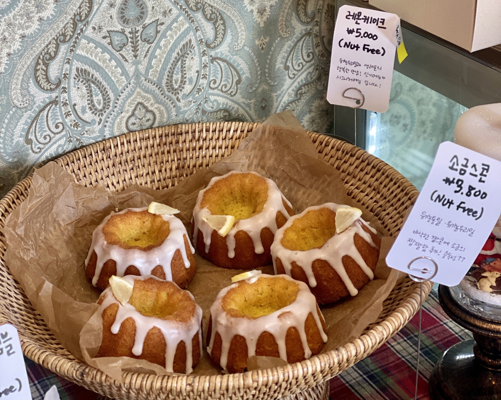
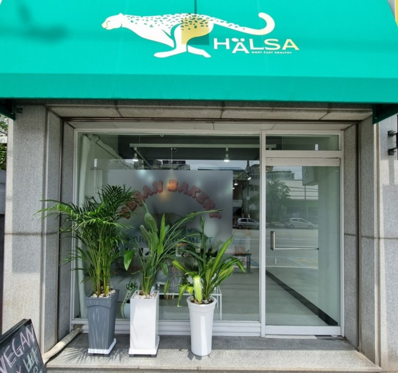
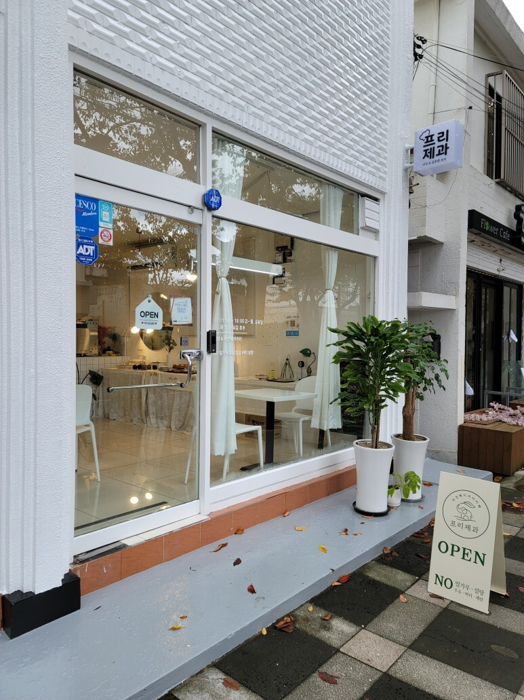

비건이라는 말이 더는 낯설지 않은 시대가 됐다. 

그러나 비건이 시중에서 판매하는 대부분의 빵과 과자를 먹지 못한다는 사실은 놀랍게 느낄 수 있을 것이다. 
하지만 섣부른 걱정은 금물! 동물성 재료가 들어가지 않아도 맛있는 비건 빵집이 은근히 많기 때문이다. 
비건은 물론, 비건이 아니어도 찾아갈 만한 이유가 충분한 비건 빵집을 모아봤다.

---

### 여덟 가지 착한 재료
## 8빵

군자역 인근에 위치한 ‘8빵’은 이름처럼 여덟 가지 주재료를 사용해 건강한 빵을 만드는 곳이다. 이곳 빵의 주재료는 국내산 무농약 통밀가루와 밀가루, 국내산 쌀가루와 찹쌀가루, 리지 현미유, 비정제 원당, 히말라야 핑크 솔트, 무첨가 두유, 제철 과일과 채소이며 다른 부재료도 100% 식물성으로 사용하기 때문에 비건에게 인기 만점. 식사 빵부터 디저트까지 종류가 다양해서 고르는 재미도 쏠쏠하다. 매일 조금씩 달라지는 라인업은 인스타그램을 참고할 것.

📍 주소 : 서울시 광진구 능동로32길 5

⏰ 영업시간 : 낮 12시~오후 8시(수~토요일), 일~화요일 휴무

🏷 가격 : 레몬 케이크 4800원, 무화과 스콘 3800원

--- 

### 건강해지는 빵집
## 할사

강릉시 교동에 문을 연 ‘할사’는 환경을 생각하는 채식을 지향하는 빵집이다. 모든 식재료는 유기농, 친환경, 국산을 사용하며 빵에 들어가는 두유도 직접 만들어 쓸 만큼 수제를 고집한다. 제품군도 작은 구움 과자부터 주문 제작하는 케이크까지 다양해 선택의 폭이 넓은 것이 장점. 매장에서 판매하는 음료 역시 식물성 재료를 사용하며, 모든 베이스를 직접 만들기 때문에 안심하고 먹을 수 있다. 특히 이곳만의 디톡스 음료는 빵·과자와 더불어 꼭 먹어봐야 할 메뉴.

📍 주소 : 강원도 강릉시 강릉대로 153

⏰ 영업시간 : 오전 10시~오후8시(화~일요일), 월요일 휴무

🏷 가격 : 비건 쿠키 2500원, 비건 파운드3500원

---

### 모두에게 열린 빵집
## 프리제과

제주도의 ‘프리제과’는 몸에 해로운 식재료로부터 자유로운 빵집이다. 밀가루, 우유, 달걀, 버터, 설탕을 일체 사용하지 않아 비건뿐아니라 글루텐 및 유당 불내증, 아토피피부염이 있는 사람도 마음 놓고 먹을 수 있는 제품을 선보인다. 쿠키나 머핀부터 식빵까지 다양한 빵을 매일 매장에서 직접 구워 판매하며, 현지인은 물론 관광객의 발길도 끊이지 않기 때문에 늦게 가면 품절되어 문을 닫는 경우도 있다. 참고로 3만 원 이상부터 예약 구매가 가능하다.

📍 주소 : 제주도 제주시 전농로 28

⏰ 영업시간 : 오전 11시~오후 6시(목~월요일), 화~수요일 휴무

🏷 가격 : 쑥 스콘 3500원, 르뱅 쿠키 3600원